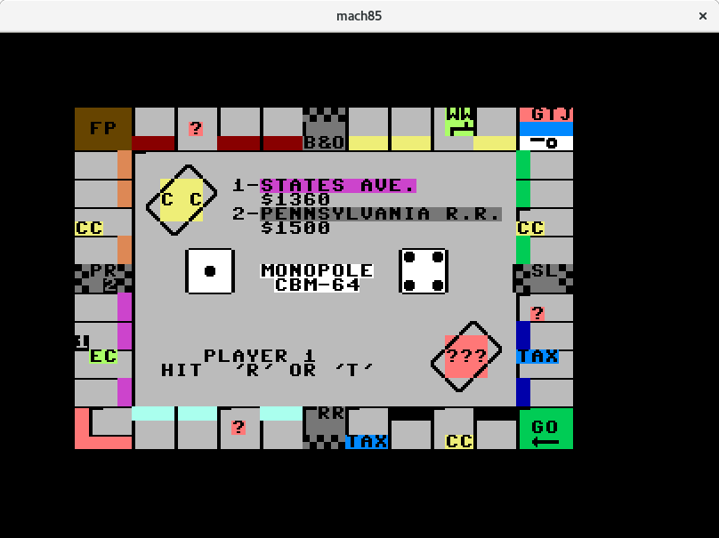

# mach85

Latest development work can be found here:

https://github.com/blackchip-org/retro-cs


[](https://travis-ci.org/blackchip-org/mach85)

Mach-85: The Virtual Machinery Playpen. Inspired by the Vintage Computer Club.

This has no practical value.

Emulates a CPU in the 6502 family. And maybe some Commodore stuff too. Of
the 64 variety.

## Installation

Requirements:

- go
- SDL2
- ROMs

### Ubuntu

Known to work on Ubuntu 18.04. Earlier versions have problems getting go and
SDL to work together.

Install go and SDL2 with:

```bash
sudo apt-get install -y \
    golang \
    libsdl2-dev \
    libsdl2-image-dev \
    libsdl2-mixer-dev \
    libsdl2-ttf-dev \
    libsdl2-gfx-dev
```

### macOS

Install [Homebrew](https://brew.sh).

Install go and SDL2 with:

```bash
brew install \
    go \
    sdl2{,_image,_mixer,_ttf,_gfx} \
    pkg-config
```

### Setup

```bash
mkdir -p ~/go/src/github.com/blackchip-org
cd ~/go/src/github.com/blackchip-org
git clone https://github.com/blackchip-org/mach85.git
cd mach85
go get
```

### ROMs

Find ROMs from [somewhere](http://blackchip.org/cbm/c64/) and place in the
`rom` directory. Filenames should be as follows:

- kernal.rom
- basic.rom
- chargen.rom

### Run

```
go run cmd/mach85/main.go
```

## Documentation

Don't use this [undocumented documentation](https://godoc.org/github.com/blackchip-org/mach85).

## Progress

The classic game of Monopole written in BASIC works:



No graphics, no sound, no timings.

More to come? We shall see.


